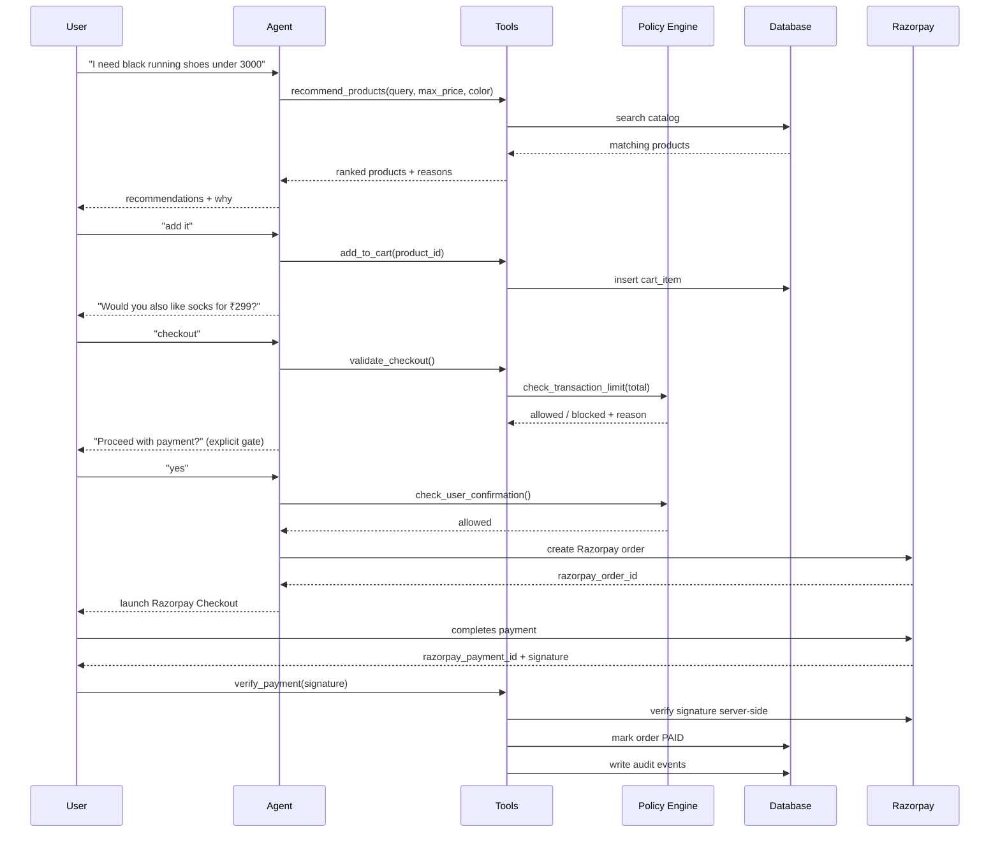
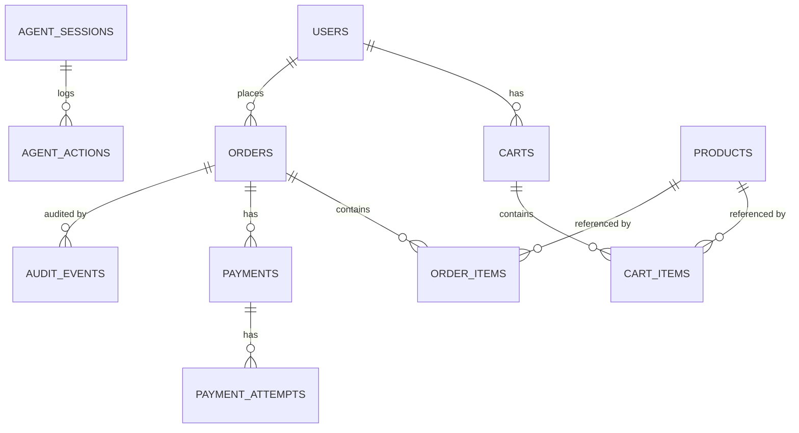

# PayPilot AI

**An explainable, bounded AI shopping agent that turns product discovery into safe agentic checkout.**

Built for Razorpay's AI Buildathon — Track 01: *AI Growth & Agentic Commerce*.

> Every money action in this project is explainable, bounded, and gated. The agent can
> *propose* an action ("charge the user ₹7,000"); only the backend policy engine can
> *allow* it. Every decision is written to an immutable audit trail.

---

## 1. Problem

Conversational commerce promises that a customer can just *say* what they want and an
AI agent handles discovery, recommendation, upsell, and checkout. The hard part isn't
the conversation — it's making sure an LLM never gets to unilaterally move money.
Most "AI shopping agent" demos either (a) skip real payments entirely, or (b) let the
model call the payment API directly, with no guardrails, no audit trail, and no
graceful failure handling.

## 2. Solution

PayPilot AI separates **conversation** from **authority**:

- An agent (rule-based NLU by default, swappable for Claude tool-calling) understands
  intent and proposes tool calls: search, recommend, add to cart, checkout.
- A **policy engine** (`backend/app/policy.py`) is the only thing that can approve a
  payment. It re-derives the truth from the database on every call — it never trusts
  the agent's judgement.
- Every tool call, policy decision, and payment state transition is written to an
  **append-only audit trail**, viewable per-order in the merchant dashboard.
- Razorpay integration follows fintech best practice: the backend creates the order,
  the frontend collects payment, and the backend is the *only* party that verifies the
  cryptographic signature before an order is marked paid. Idempotency keys and a
  bounded retry count prevent duplicate charges.

## 3. Why AI is necessary here

A traditional search UI forces the customer to translate their need ("something for
daily running, under ₹3000, black") into filters, forms, and page navigation. The
agent does that translation, explains *why* each recommendation fits, and negotiates
upsells the way a good in-store assistant would — without ever being trusted with the
"pay" button itself.

---

## 4. Architecture

```mermaid
flowchart LR
    subgraph Customer
        UI[React Shopping UI]
    end
    subgraph Backend[FastAPI Backend]
        Agent[Agent Orchestrator\n(rule-based NLU / optional Claude tool-calling)]
        Tools[Bounded Tool Layer]
        Policy[Policy Engine]
        Services[Cart / Order / Payment Services]
        Audit[(Audit Trail)]
        DB[(SQLite / Postgres)]
    end
    subgraph Razorpay[Razorpay TEST MODE]
        RP[Checkout + Orders API]
    end

    UI -- "POST /api/chat" --> Agent
    Agent --> Tools
    Tools --> Services
    Services --> Policy
    Policy -->|allowed/blocked + reason| Services
    Services --> DB
    Services --> Audit
    Services -- "create order" --> RP
    UI -- "Razorpay Checkout.js" --> RP
    RP -- "payment response" --> UI
    UI -- "POST /api/payments/verify" --> Services
    RP -. webhook .-> Backend
```

## 5. Agent tool architecture

The LLM/agent never touches the database or Razorpay directly. It can only call:

```
search_products()          get_product_details()      recommend_products()
get_cart()                  add_to_cart()               remove_from_cart()
calculate_cart_total()       validate_checkout()         create_order()
create_razorpay_order()      get_payment_status()        verify_payment()
record_audit_event()
```

Each tool call is logged to `agent_actions` with its input, output, and whether the
backend allowed it — so a judge can inspect exactly what the agent tried to do versus
what actually happened.



## 6. Financial safety model

All limits live in one place: `backend/app/config.py` / `.env`.

| Setting | Default | Purpose |
|---|---|---|
| `MAX_TRANSACTION_AMOUNT_INR` | 5000 | Hard ceiling on any single order |
| `REQUIRE_USER_CONFIRMATION` | true | No payment without an explicit "yes" |
| `MAX_PAYMENT_RETRY_ATTEMPTS` | 2 | Bounded retries after failure |
| `MAX_ORDER_CREATION_ATTEMPTS` | 1 | One Razorpay order per PayPilot order (idempotency) |
| `ALLOW_AUTOMATIC_UPSELL` | false | Upsells are suggested, never auto-added |
| `ALLOW_AUTOMATIC_PAYMENT` | false | The agent can never trigger a charge on its own |

Every policy check (`backend/app/policy.py`) returns a `PolicyDecision` with a
human-readable explanation, e.g.:

```
Payment blocked because:
• Requested amount ₹8999 exceeds ₹5000 transaction policy.
```

## 7. Razorpay integration & payment flow

1. Backend creates a Razorpay TEST MODE order (`POST /api/payments/create`) — only
   after the confirmation gate and transaction-limit gate both pass.
2. Frontend opens Razorpay Checkout with the returned `order_id` + `key_id`.
3. User completes (or fails, or cancels) the test payment.
4. Frontend sends the payment id + signature to `POST /api/payments/verify`.
5. **Backend verifies the signature server-side** (`razorpay.Client.utility
   .verify_payment_signature`) — frontend state is never trusted.
6. Order status flips to `PAID` only after verification succeeds; every step writes an
   audit event.
7. A `POST /api/webhooks/razorpay` endpoint independently verifies webhook signatures
   and deduplicates by `event_id`, as a second source of truth for payment capture.

If you don't have Razorpay test keys handy, the backend runs in **mock mode**
automatically (see `backend/app/services/razorpay_client.py`): it exercises the exact
same order-creation, signature-verification, idempotency, and retry code paths using a
locally-computed HMAC signature instead of a real Razorpay account. Every mock action
is tagged `is_mock: true` in the audit trail and the frontend shows a clearly-labelled
"SIMULATED CHECKOUT" modal — it is never presented as a real transaction.

## 8. Idempotency & duplicate-payment protection

- **Order creation**: `Order.idempotency_key` is a hash of the cart's exact contents.
  Re-submitting the same cart returns the existing order rather than creating a new
  one (`order_service.get_or_create_order_from_cart`).
- **Razorpay order creation**: `payment_service.create_payment_for_order` checks for an
  existing `Payment` row for the order before calling Razorpay; if one exists, it's
  reused (`RAZORPAY_ORDER_REUSED` audit event).
- **Retries**: bounded by `MAX_PAYMENT_RETRY_ATTEMPTS`; each attempt is logged to
  `payment_attempts`, and the retry endpoint reuses the same Razorpay order rather than
  minting a new one.
- **Webhooks**: every delivery's `event_id` is stored in `webhook_events` with a unique
  constraint; a redelivered webhook is detected and ignored before any state change.

## 9. Database schema



Full model definitions: `backend/app/models.py`.

## 10. API surface

```
GET  /api/health
GET  /api/products                     GET /api/products/{id}
GET  /api/cart                         POST /api/cart/items         DELETE /api/cart/items/{id}
POST /api/chat
POST /api/checkout/validate            POST /api/orders              GET /api/orders/{id}
GET  /api/orders/{id}/detail
POST /api/payments/create              POST /api/payments/verify
POST /api/payments/retry               GET  /api/payments/status/{order_id}
POST /api/payments/mock-complete       (demo-only, mock mode)
POST /api/webhooks/razorpay
GET  /api/audit/{order_id}
GET  /api/analytics
POST /api/demo/simulate                GET  /api/demo/simulate/latest
```

## 11. Security

- Razorpay credentials read from environment variables only; never hardcoded.
- All payment success is decided server-side via cryptographic signature
  verification — the frontend cannot fake a paid order.
- Webhook signatures verified with `hmac.compare_digest` (constant-time).
- SQLAlchemy ORM (parameterized queries) — no raw SQL string interpolation.
- CORS restricted to configured origins.
- A global exception handler prevents stack traces / secrets leaking in error
  responses.
- No card, PAN, or other sensitive payment data is ever stored — only Razorpay's
  order/payment IDs.

## 12. Setup

### Backend

```bash
cd backend
cp .env.example .env        # add real Razorpay TEST keys if you have them (optional)
python3 -m venv .venv && source .venv/bin/activate
pip install -r requirements.txt
uvicorn app.main:app --reload --port 8000
```
(or just run `./run.sh`, which does all of the above)

The catalog and a demo user are seeded automatically on startup.

### Frontend

```bash
cd frontend
cp .env.example .env
npm install
npm run dev
```
Open http://localhost:5173.

### Tests

```bash
cd backend
source .venv/bin/activate
pytest -v
```

## 13. Demo scenarios

See `DEMO_SCRIPT.md` for the full walkthrough. In short, the Shop page has one-click
buttons for:

- **A** — Successful purchase
- **B** — Upsell accepted
- **C** — Payment failure (simulate failed payment, see bounded retry)
- **D** — Over spending limit (blocked by policy)
- **E** — Duplicate/retry protection (idempotent order + Razorpay order reuse)

## 14. Metrics methodology

`GET /api/analytics` computes GMV, AOV, upsell acceptance, and payment success rate
**only from real orders/payments processed by this running instance** — no invented
numbers. `POST /api/demo/simulate` separately runs a reproducible, seeded batch of 100
scripted shopping sessions through the exact same agent + policy code path, and stores
results in a dedicated `simulation_runs` table that analytics never reads from. The
dashboard labels this panel **SYNTHETIC/SIMULATED** and it is never blended into the
real GMV figures.

## 15. Known limitations

- The default NLU is deterministic rule-based parsing, not a general-purpose LLM — it
  handles the demo's vocabulary well but won't parse arbitrary phrasing. A Claude
  tool-calling path can replace just the NLU layer without touching policy enforcement.
- Single-currency (INR), single-merchant catalog.
- SQLite by default; swap `DATABASE_URL` for Postgres in production (SQLAlchemy models
  are already dialect-agnostic).
- No user authentication — a single demo user for the hackathon.

## 16. Future improvements

- Real Claude tool-calling NLU with the existing bounded tool layer unchanged.
- Multi-merchant catalogs and per-merchant policy configuration.
- Postgres + Alembic migrations for production deployment.
- Rate limiting middleware and per-user session auth.
- Expanded webhook coverage (refunds, disputes).
